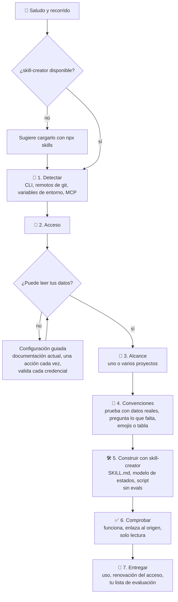

# whats-next-metaskill

🇬🇧 [Read in English](./README.md)

Una **metaskill**: una skill que construye otra skill. Te guía paso a paso para
crear tu propio **whats-next**, la skill que responde a *"¿qué tengo pendiente
hoy?"* leyendo tu gestor de tareas real.

Funciona con **cualquier sistema**: GitHub, GitLab, Jira, Linear, Azure DevOps,
Trello, Asana, Notion, un gestor instalado en tu propio servidor o dos a la vez
(por ejemplo, tareas en Jira y código en GitHub).

La metaskill vive en [`skills/whats-next-builder/`](./skills/whats-next-builder).

## Funcionalidades

**El asistente**

- 👋 Asistente paso a paso con barra de progreso ASCII, en tu idioma.
- 🔎 Detecta tu sistema por su cuenta: CLI instalados, remotos de git, nombres de
  credenciales exportadas y servidores MCP. Solo pregunta lo que no puede ver.
- 🔑 Te guía para configurar el acceso (login en un CLI, token de API, registro
  de una app) con la documentación oficial actual, una acción cada vez, y valida
  cada credencial en cuanto la tienes.
- 🎯 Uno o varios proyectos, elegidos entre los que ve tu cuenta.
- 🧭 Hace consultas de prueba sobre tus datos reales y solo te pregunta lo que tu
  sistema no puede decirle: qué estados significan «en QA», qué etiqueta marca
  prioridad, cómo enlazas una PR con su ticket.
- 🛠️ Escribe la skill con [skill-creator](https://github.com/anthropics/skills)
  y te lo sugiere si no lo tienes.
- ✅ Comprueba que el script de la skill funciona, enlaza cada tarea con su
  origen y no puede escribir.
- 🎁 Te entrega cómo usarla, cómo renovar el acceso y una lista para evaluarla.
  No lanza evals por ti: juzgar la skill te toca a ti.
- 📚 Una referencia de unos 30 sistemas conocidos con su CLI oficial y su
  documentación de API, para empezar con ventaja. Los sistemas que no están en
  la lista siguen el mismo proceso.

**La skill whats-next que obtienes**

- 🔥 Lo que tienes entre manos ahora, ordenado por cuánto desbloquea cada acción.
- 📌 El trabajo asignado a ti, primero lo que vence hoy o ya ha vencido.
- 🙋 El trabajo sin asignar.
- 💬 Los comentarios que esperan tu respuesta.
- 👀 Las PR/MR que tienes que revisar y 🔁 las que te han devuelto.
- 🔀 Tus PR/MR listas para mergear, ✍️ con cambios pedidos, 💥 con conflictos o
  🔴 con el CI en rojo.
- ⏳ Lo que estás esperando y quién te lo debe.
- 🧊 Lo que está atascado o en riesgo.
- 📊 Milestones, sprints o proyectos: días que quedan, abiertas frente a
  cerradas, reparto por persona.
- 🩹 Desajustes del tablero: estados que ya no cuadran con lo que ha pasado.
- 🔗 Cada id de tarea es un enlace clicable a su origen: enlaces markdown en el
  chat e hipervínculos OSC 8 cuando imprimes el informe directamente en la
  terminal (`--render`).
- Responde con emojis o en tabla, en tu idioma.
- Solo lectura por diseño, sin credenciales guardadas en sus archivos y con una
  sección Setup para renovar el acceso cuando caduque.

## Ejemplo de respuesta

Lo que contesta un whats-next generado a *"¿qué tengo pendiente hoy?"*:

```
📋 5 contigo · ⏳ 2 esperando · 🧊 1 atascado · 🎯 El Sprint 42 cierra en 3 días
⏰ Vence hoy: #512

🔥 AHORA
  🔀 !482 Upgrade the HTTP client library
     Aprobada · CI en verde · sin hilos abiertos
     → mergéala
  🔁 !477 Add CSV export to reports
     Ana te pidió revisarla otra vez hace 5 h · 1 hilo abierto
     → vuelve a leerla
  💬 #530 Retry failed webhook deliveries
     Luis te mencionó ayer y nadie ha contestado
     → respóndele
  +2 más: 1 👀 revisión, 1 📌 sin empezar

⏳ ESPERANDO
  !471 Ana te debe la revisión desde hace 4 días · 🔔 merece un toque
  #525 Password reset emails · en QA desde el lunes

🧊 ATASCADO
  💥 !466 Conflictos con main · 5 días parada

🙋 SIN ASIGNAR (3 en el Sprint 42)
  #541 Search filters on the dashboard · prioridad alta

📊 SPRINT 42 · 12 abiertas / 30 cerradas · quedan 3 días
  ana 5 · tú 4 · sin asignar 3
  ⚠️ 2 sin empezar con el cierre encima

🩹 TABLERO VS REALIDAD
  #503 dice "To do" · !466 está abierta → "In progress"
```

Los títulos y los estados del gestor (`To do`, `In progress`) se quedan tal
cual; el resto sale en tu idioma. En tu terminal cada referencia es un enlace
clicable. Si pides la vista en tabla, la misma respuesta llega como una tabla
por bloque.

## Cómo funciona



Cada paso empieza con una barra de progreso para que sepas siempre qué falta:

```
[###----] 3/7 🎯 Scope
Next: 🧭 Conventions · 🛠️ Build · ✅ Check · 🎁 Hand over
```

Por dentro se apoya en tres piezas:

- **skill-creator**, para escribir la skill.
- **Un modelo de estados** heredado de un whats-next real e independiente del
  sistema: qué señales consultar y cómo decidir quién tiene la pelota.
- **Tus respuestas**, para lo que solo sabes tú.

La metaskill **no incluye código de ningún sistema**. El script que lee tus
tareas se escribe en el paso 5 contra tu API real, así que no se limita a lo que
todos los sistemas tienen en común.

## Instalación

Con [`skills`](https://github.com/vercel-labs/skills):

```bash
# para todos tus proyectos
npx skills add webreactiva/whats-next-metaskill -g

# solo para el proyecto actual
npx skills add webreactiva/whats-next-metaskill
```

Añade `-a claude-code` (u otro agente) para elegir dónde se instala.

**Recomendado:** [skill-creator](https://github.com/anthropics/skills). El
asistente te lo sugiere si no lo tienes. Para instalarlo por tu cuenta:

```bash
npx skills add https://github.com/anthropics/skills --skill skill-creator -g
```

## Uso

Pídeselo a tu agente con tus palabras:

```
créame un whats-next para Jira
quiero una skill que me diga qué PR tengo que revisar en GitHub
adapta whats-next a mi tablero de Trello
```

O lánzala directamente:

```
/whats-next-builder
```

## Qué obtienes

```
whats-next/
├── SKILL.md                    # cuándo usarla, formato de respuesta, configuración del acceso
├── references/state-model.md   # estados, de dónde sale cada dato, límites conocidos
└── scripts/collect.py          # el script de solo lectura para tu sistema
```

Las convenciones de tu equipo (proyectos, estados, etiquetas) viven en **un
único sitio** del script, así que cambiar una es editar una línea.

## Evaluar la skill generada

**La evaluación es tuya.** El asistente no lanza evals; te deja esta lista:

1. En una sesión nueva, hazle las preguntas reales: qué tengo pendiente hoy, qué
   estoy esperando, qué tengo que revisar, me han contestado, qué hay sin
   asignar, cómo va el sprint.
2. Elige tres elementos de la respuesta y ábrelos en tu gestor. ¿El estado y
   quién tiene la pelota son correctos?
3. Si una línea está mal, casi siempre es una convención: cámbiala donde viven
   las convenciones o vuelve a lanzar el asistente para ajustarla.
4. Si quieres un benchmark formal, lanza tú el ciclo de evals de skill-creator
   sobre la skill nueva.

## Sistemas conocidos

[`references/systems.md`](./skills/whats-next-builder/references/systems.md)
recoge unos 30 sistemas con su CLI oficial (cuando existe) y su documentación
oficial de API. Es un punto de partida, no una lista cerrada.

## Feedback

Dani, de [webreactiva.com](https://webreactiva.com), espera que te sea útil.
Ideas, fallos o sistemas que se te resistan:
[github.com/webreactiva/whats-next-metaskill/issues](https://github.com/webreactiva/whats-next-metaskill/issues).
