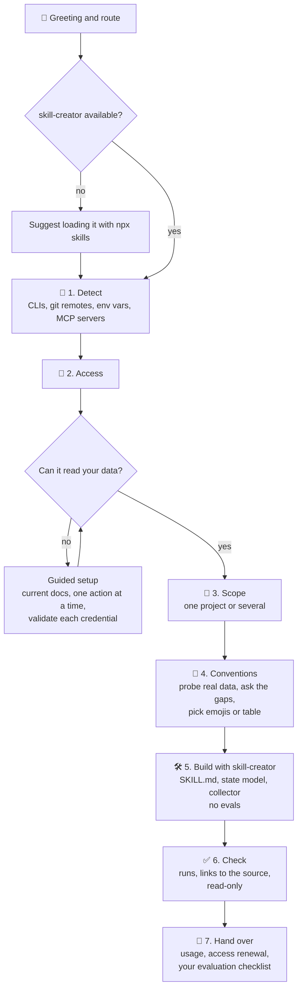

# whats-next-builder

🇪🇸 [Leer en español](./README.es.md)

A **metaskill**: a skill that builds another skill. It walks you through creating
your own **whats-next**, the skill that answers *"what do I have pending today?"*
by reading your real task manager.

It works with **any system**: GitHub, GitLab, Jira, Linear, Azure DevOps, Trello,
Asana, Notion, a self-hosted tracker, or two at once (tickets in Jira and code in
GitHub, for example).

The metaskill lives in [`skills/whats-next-builder/`](./skills/whats-next-builder).

## Features

**The wizard**

- 👋 Step-by-step wizard with an ASCII progress bar, in your language.
- 🔎 Detects your system on its own: installed CLIs, git remotes, exported
  credential names and MCP servers. It only asks what it cannot see.
- 🔑 Guided access setup (CLI login, API token, app registration) checked
  against the current official docs, one action at a time, validating every
  credential as soon as you have it.
- 🎯 One project or several, picked from what your account can see.
- 🧭 Probes your real data and asks only what your system cannot tell it: which
  statuses mean "in QA", which label means priority, how a PR points to its
  ticket.
- 🛠️ Writes the skill with [skill-creator](https://github.com/anthropics/skills)
  and suggests it if you do not have it.
- ✅ Checks the generated collector runs, links every task to its source and
  cannot write.
- 🎁 Hands over usage, access renewal and an evaluation checklist. It runs no
  evals for you: judging the skill is your call.
- 📚 A reference of about 30 known systems with their official CLI and API docs,
  as a head start. Systems not on the list follow the same process.

**The whats-next skill you get**

- 🔥 What is on you now, ranked by how much each action unblocks.
- 📌 Work assigned to you, due today or overdue first.
- 🙋 Unassigned work.
- 💬 Comments waiting for your reply.
- 👀 PRs/MRs you have to review, and 🔁 the ones that came back to you.
- 🔀 Your PRs/MRs ready to merge, ✍️ with changes requested, 💥 with conflicts or
  🔴 failing CI.
- ⏳ What you are waiting on, and who owes it.
- 🧊 What is stuck or at risk.
- 📊 Milestones, sprints or projects: days left, open vs closed, split by owner.
- 🩹 Board drift: statuses that no longer match what the work did.
- 🔗 Every task id is a clickable link to its source: markdown links in the chat,
  OSC 8 hyperlinks when you print the report straight in the terminal
  (`--render`).
- Answers with emojis or as a table, in your language.
- Read-only by construction, credentials never stored in its files, and a Setup
  section to renew access when it expires.

## Example answer

What a generated whats-next replies to *"what do I have pending today?"*:

```
📋 5 on you · ⏳ 2 waiting · 🧊 1 stuck · 🎯 Sprint 42 closes in 3 days
⏰ Due today: #512

🔥 NOW
  🔀 !482 Upgrade the HTTP client library
     Approved · CI green · no open threads
     → merge it
  🔁 !477 Add CSV export to reports
     Ana asked you to review again 5 h ago · 1 open thread
     → read it again
  💬 #530 Retry failed webhook deliveries
     Luis mentioned you yesterday and nobody answered
     → reply
  +2 more: 1 👀 review, 1 📌 not started

⏳ WAITING
  !471 Ana has owed you the review for 4 days · 🔔 worth a nudge
  #525 Password reset emails · QA since Monday

🧊 STUCK
  💥 !466 Conflicts with main · idle 5 days

🙋 UNASSIGNED (3 in Sprint 42)
  #541 Search filters on the dashboard · high priority

📊 SPRINT 42 · 12 open / 30 closed · 3 days left
  ana 5 · you 4 · unassigned 3
  ⚠️ 2 not started with the deadline close

🩹 BOARD VS REALITY
  #503 says "To do" · !466 is open → "In progress"
```

In your terminal every reference is a clickable link. Ask for the table view and
the same answer comes as one table per block.

## How it works



Each step opens with a progress bar so you always know what is left:

```
[###----] 3/7 🎯 Scope
Next: 🧭 Conventions · 🛠️ Build · ✅ Check · 🎁 Hand over
```

Under the hood it stands on three pieces:

- **skill-creator**, to write the skill.
- **A state model** inherited from a real whats-next and independent of any
  system: which signals to query and how to decide who holds the ball.
- **Your answers**, for what only you know.

The metaskill ships **no code for any system**. The script that reads your tasks
is written during step 5 against your real API, so it is not limited to what
every system has in common.

## Installation

With [`skills`](https://github.com/vercel-labs/skills):

```bash
# for all your projects
npx skills add webreactiva/whats-next-builder -g

# for the current project only
npx skills add webreactiva/whats-next-builder
```

Add `-a claude-code` (or another agent) to choose where it goes.

**Recommended:** [skill-creator](https://github.com/anthropics/skills). The
wizard suggests it when it is missing. To install it yourself:

```bash
npx skills add https://github.com/anthropics/skills --skill skill-creator -g
```

## Usage

Ask your agent in your own words:

```
build me a whats-next for Jira
I want a skill that tells me which PRs I have to review on GitHub
adapt whats-next to my Trello board
```

Or call it directly:

```
/whats-next-builder
```

## What you get

```
whats-next/
├── SKILL.md                    # when to use it, answer format, access setup
├── references/state-model.md   # states, where each signal comes from, known limits
└── scripts/collect.py          # the read-only collector for your system
```

Your team's conventions (projects, statuses, labels) live in **one place** in
the collector, so changing one is a one-line edit.

## Evaluating the generated skill

**The evaluation is yours.** The wizard runs no evals; it leaves you this
checklist:

1. In a new session, ask the real questions: what do I have pending today, what
   am I waiting on, what do I have to review, did anyone answer me, what is
   unassigned, how is the sprint going.
2. Pick three items from the answer and open them in your tracker. Are the state
   and the holder right?
3. When a line is wrong, it is almost always a convention: change it where the
   conventions live, or run the wizard again to adjust it.
4. For a formal benchmark, run skill-creator's eval loop on the new skill
   yourself.

## Known systems

[`references/systems.md`](./skills/whats-next-builder/references/systems.md)
lists about 30 systems with their official CLI (when there is one) and official
API docs. It is a starting point, not a closed list.

## Feedback

Dani from [webreactiva.com](https://webreactiva.com) hopes it is useful. Ideas,
bugs or systems that fight back:
[github.com/webreactiva/whats-next-builder/issues](https://github.com/webreactiva/whats-next-builder/issues).
